# Third Person Shooter

This is part of my report for the university subject **COMP30019 - Graphics and Interaction**, uploaded for my [portfolio](https://linyanzhu.com).

## Table of contents

* [UI](#UI)
* [Graphics Pipeline](#graphics-pipeline)
* [Camera Motion](#camera-motion)
* [Shaders](#shaders)
* [Particles](#particles)
* [References](#References)

## UI

**Main Menu:**

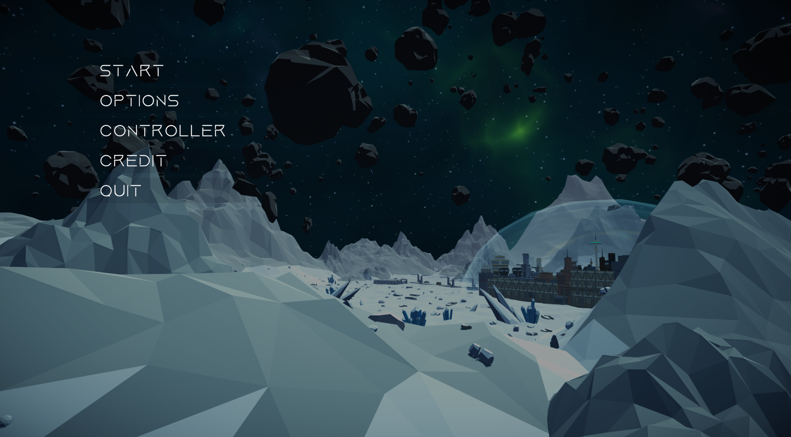

Open up the game, and the main menu would appear. 

Press **START** to start a new game.

Press **OPTIONS** to change the resolutions, graphics quality, game difficulty, etc.

Press **CONTROLLER** to view the key mapping.

Press **CREDIT** to see the game producers.

Press **QUIT** to quit the game.

**In Game:**

Our game uses traditional gaming key mappings. 

| Explanation     | Key                |
| --------------- | ------------------ |
| Move Around     | W / A / S / D      |
| Jump            | Space Bar          |
| Sprint          | Left Shift         |
| Look Around     | Mouse              |
| Aim             | Right Mouse Button |
| Fire            | Left Mouse Button  |
| Pause / Unpause | Escape             |

There’s also a tutorial at the start of the game to help the player get familiar with the controls.

**HUD:**

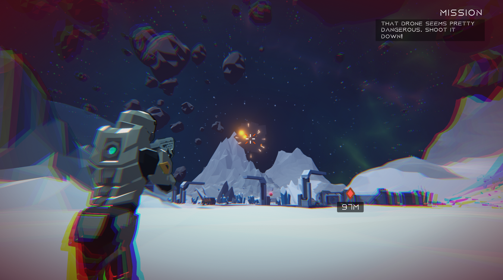

There is a white crosshair at the center to help the player aim at the enemy. The orange crosshair would appear when the player hits the weak point of an enemy.

The mission panel is at the top-right corner. The content would be updated as the player progresses forward. There is also a target indicator on the screen with the distance attached to provide some guidance.

The reddish color around the screen is used to indicate the player’s health.

**Pause Menu**

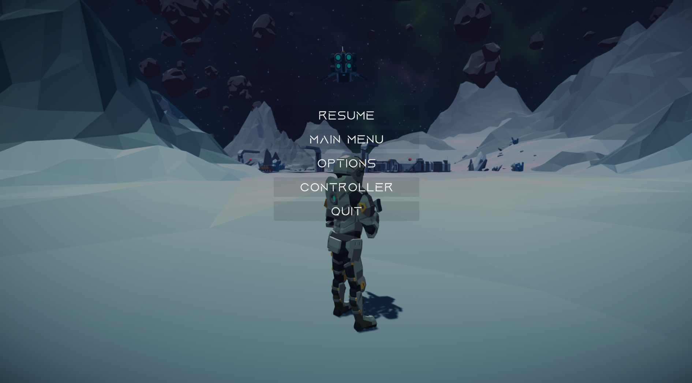

Press **RESUME** to unpause the game.

Press **MAIN MENU** to return to the main menu.

Press **OPTIONS** to change the resolutions, graphics quality, game difficulty, etc.

Press **CONTROLLER** to view the key mapping.

Press **QUIT** to quit the game.

## Graphics Pipeline

We’ve created several custom shaders to achieve the final look of our game. This includes a vertex shader, dozens of fragment shaders, and a few image effect shaders. 

Most of the game objects are using a toon shader material. We come to this decision because this is a low-poly game, and the cartoon effect combines nicely with the low-poly geometry. This shader modifies the fragment shader stage of the graphics pipeline, and all the details are fully explained under the [Shaders](#Shaders) section.

We also wrote a vertex shader to create a shield effect with floating tiles. In the vertex shader stage, different parts of the mesh are offset by different amounts, and the amount is changing as time goes by. Full details of this shader are under the [Shaders](#Shaders) section as well.

The laser material under the [Particles](#Particles) section also utilizes a custom fragment shader. The UV is moving throughout the time, combined with some other noise textures, to create a dissolving, glowing and energetic effect. 

At the output-merger stage, there are two more image effect shaders implemented. 

One is a fog shader. This one utilizes the depth texture generated by the camera and blends the fog color to the original color based on the depth.

| Fog - Before                                                 | Fog - After                                                  |
| ------------------------------------------------------------ | ------------------------------------------------------------ |
| 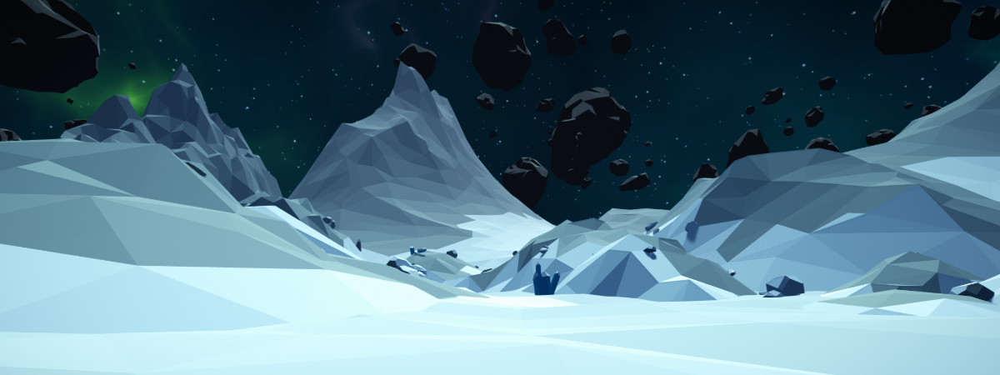 | 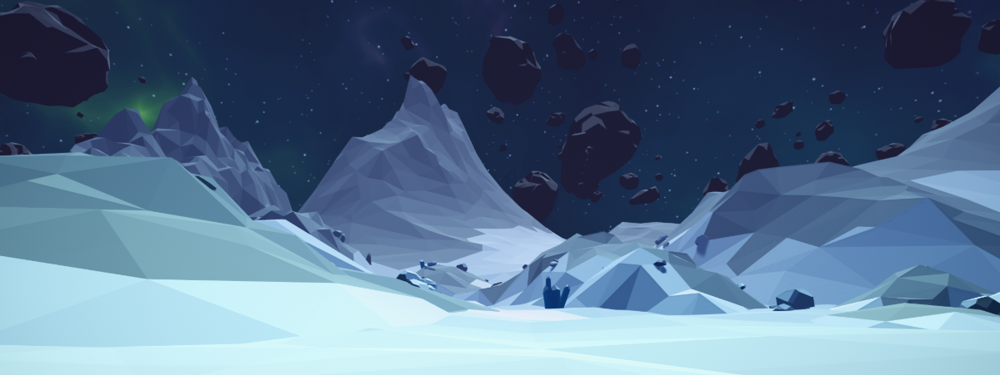 |

Another one is a grayscale shader. This is used when the player’s health is critical, to inform the player that he needs to be very careful now.

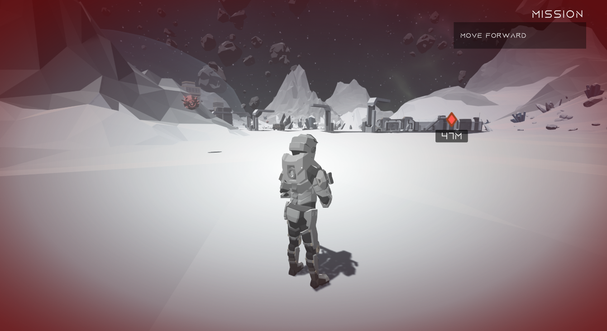

Last but not the least, the post-processing. We added Unity’s post-processing to improve our game’s visuals. It includes all the common post-processing, such as Anti-Aliasing, Bloom, Color Grading, Motion Blur, etc.

| Post Processing - Before                                     | Post Processing - After                                      |
| ------------------------------------------------------------ | ------------------------------------------------------------ |
| 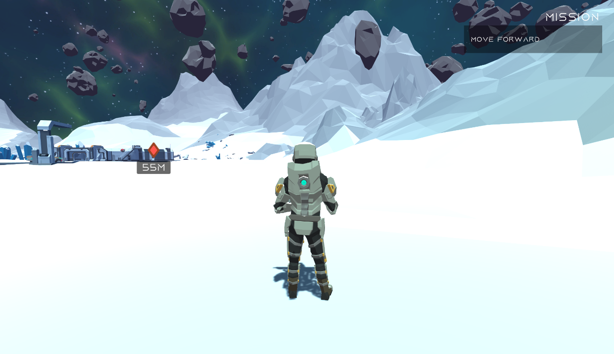 | 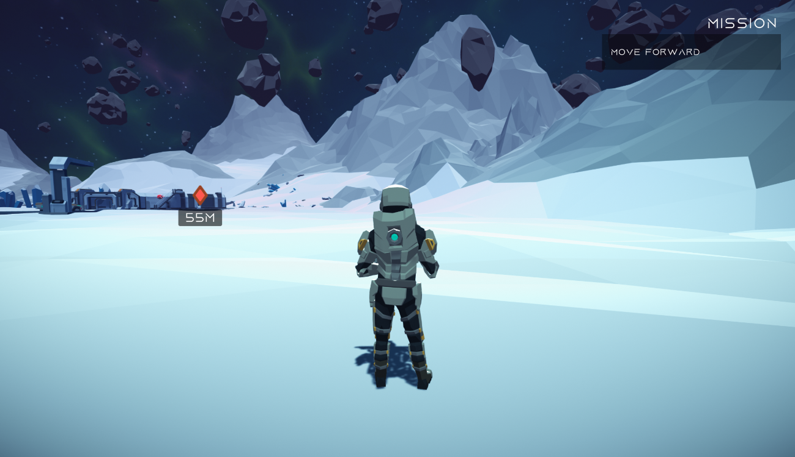 |

Post-processing is also used to give some visual feedback when the player kills an enemy.

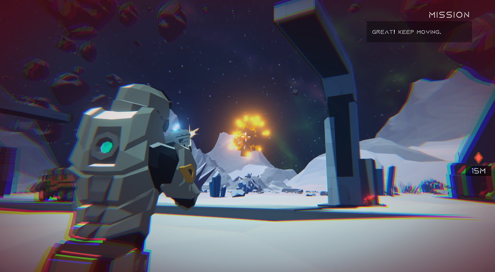

## Camera Motion

Like all other third person shooter games, we need our camera to orbit around the player at a distance. When the player is aiming, the camera also needs to move forward to create a zoom-in effect.

Instead of writing complex codes to calculate the camera’s position, my approach is to set up a “camera spring” system.

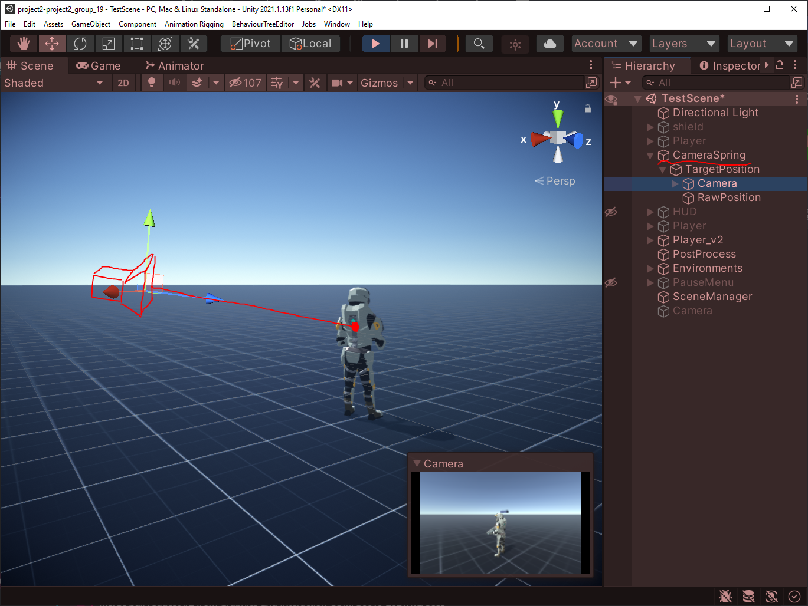

The `CameraSpring` would follow the player’s position and act as a pivot. The actual camera is attached to this pivot and offsets backward. Upon mouse inputs, I just rotate the pivot, then the camera would nicely orbit the player, without any complex math involved.

When the player is aiming, the camera needs to move closer to the player. Also, I want the camera to offset a bit to the right so that the center of the screen is not blocked by the character’s body. 

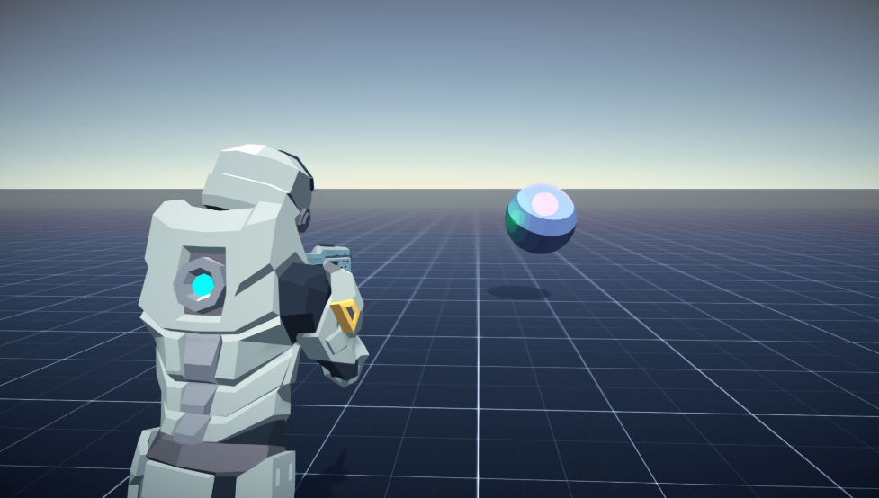

This is much harder than I thought. I tried to do some complex math but that didn’t work out great. 

In the end, my hacky solution is to have another empty game object `RawPosition` to keep track of the original position of the camera. The actual camera is attached to this game object. When the player is aiming, a local position offset is added to the camera.

The camera system also needs to detect collision or occlusion. Once there’s something in between the character and the camera, the camera needs to move closer towards the character so that our player could see what’s happening.

To do this, my solution is to perform a ray cast from the pivot position towards the camera’s position. If that hits something, I then lerp the camera to the collision point.


## Shaders

### Toon Shader


***File Location:*** `Assets/Shaders/ToonShader`

Since we are building a low poly game, a toon shader should fit our style pretty well.

As demonstrated in the gif above, there are plenty of options available for you to customize. You can adjust the number of shadow bands, several colors, glossiness, and the rim. 

Next, I will briefly talk about how I created this shader.

First, create a fresh unlit shader, add a main texture property and a tint color property.

Sample the main texture and multiply it by the tint color. 

```CG
_MainTex ("Texture", 2D) = "white" {}
_Tint ("Tint Color", Color) = (1,1,1,1)

...

fixed4 tex = tex2D(_MainTex, i.uv);
return tex * _Tint;
```

This is how it’s look like. Pretty simple.

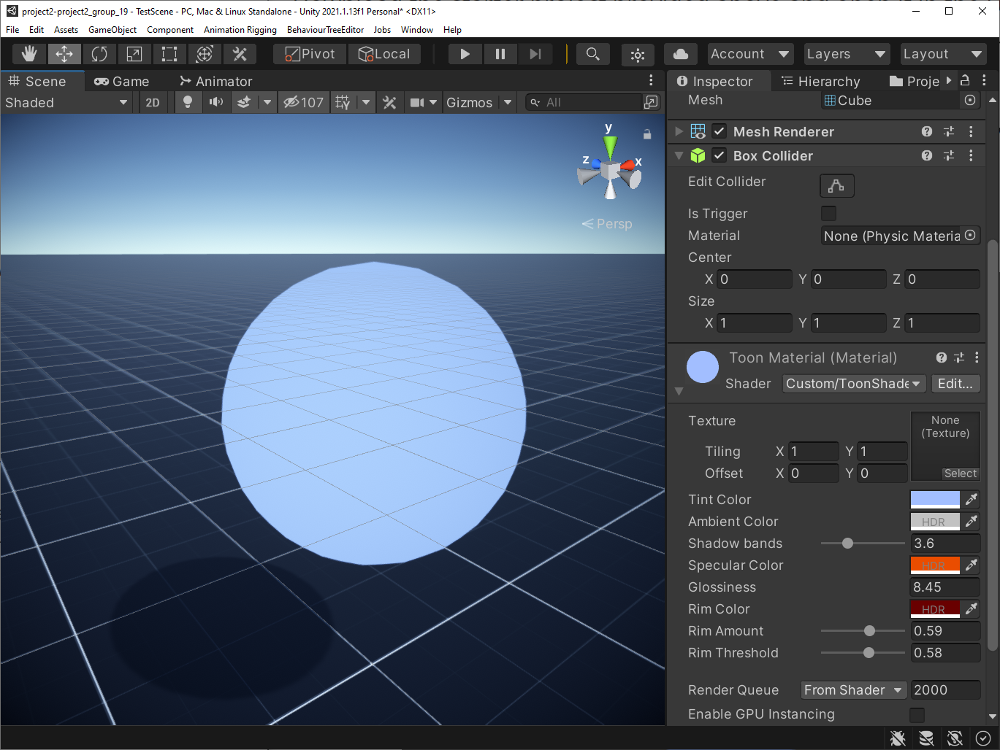

Now we can use the dot product between the face normal and the light direction to simulate diffusion. `_WorldSpaceLightPos0` is the position of the “sun” (directional light).

The dot product would give us a value between -1 and 1. When the angle between two vectors is smaller than 90 degrees, the dot product would be positive. The smaller the angle, the greater the value. 

We can multiply that to our base color like this:

```CG
float3 normal = normalize(i.worldNormal);
float NdotL = dot(_WorldSpaceLightPos0, normal);

return tex * _Tint * NdotL;
```

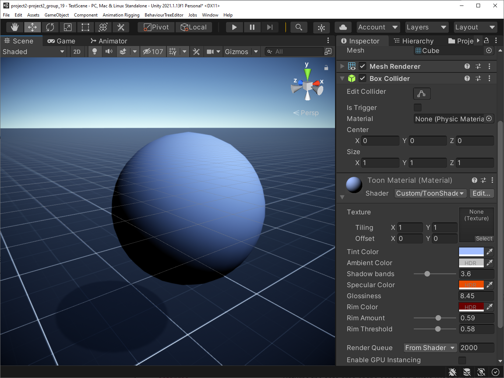

Next, to make it cartoonish, we need to divide the lighting into several bands. 

A bit of math can achieve that.

```CG
_ShadowBands("Shadow bands", Range(1,10)) = 1

...

float lightIntensity = round(NdotL * _ShadowBands) / _ShadowBands;
return tex * _Tint * lightIntensity;
```

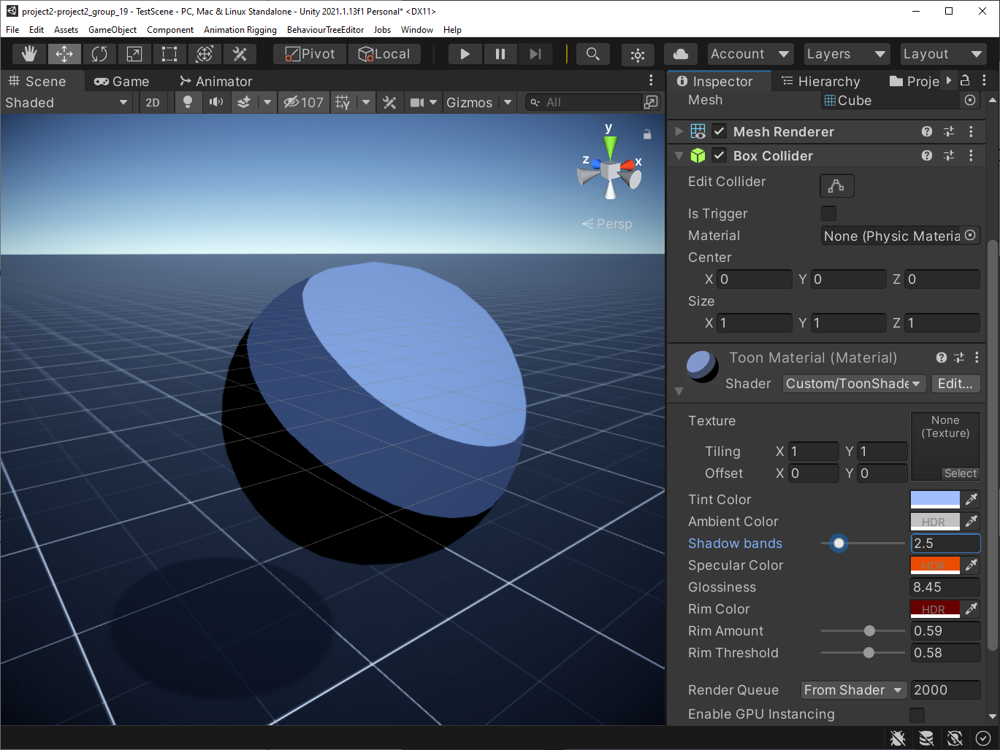

It starts to become interesting now. But the dark side is way too dark. We can simply add some fake ambient lighting to make it brighter.

```CG
[HDR]
_AmbientColor ("Ambient Color", Color) = (0.4,0.4,0.4,1)

...

float4 ambient = (1.0 - lightIntensity) * _AmbientColor;
return tex * _Tint * lightIntensity + ambient;
```

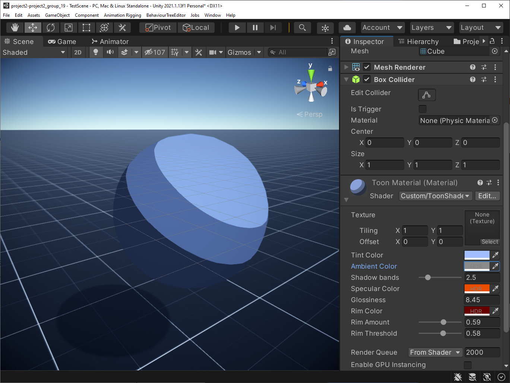

The next step is to add some specular. I’m using the same Blinn-Phong model as described in the workshop, so I won’t explain it here. 

However, I added a few changes such as multiplying the specular intensity by the variable `Glossiness` and clamping the fadeout at the edge to make it toon-like.

```CG
[HDR]
_SpecularColor("Specular Color", Color) = (0.9,0.9,0.9,1)
_Glossiness("Glossiness", Float) = 32

...

/* 
    Specular Blinn-Phong 
*/
float3 viewDir = normalize(i.viewDir);

// H = (L + V) / (|| L + V ||)
float3 halfVector = normalize(_WorldSpaceLightPos0 + viewDir);
float NdotH = dot(normal, halfVector);

// _Glossiness ^ 2 makes it easier to control the size of the specular
float specularIntensity = pow(NdotH * lightIntensityRaw, _Glossiness * _Glossiness);

// clamping the fadeout at the edge
float specularIntensitySmooth = smoothstep(0.005, 0.01, specularIntensity);
float4 specular = specularIntensitySmooth * _SpecularColor;

return tex * _Tint * (lightIntensity + ambient + specular);
```

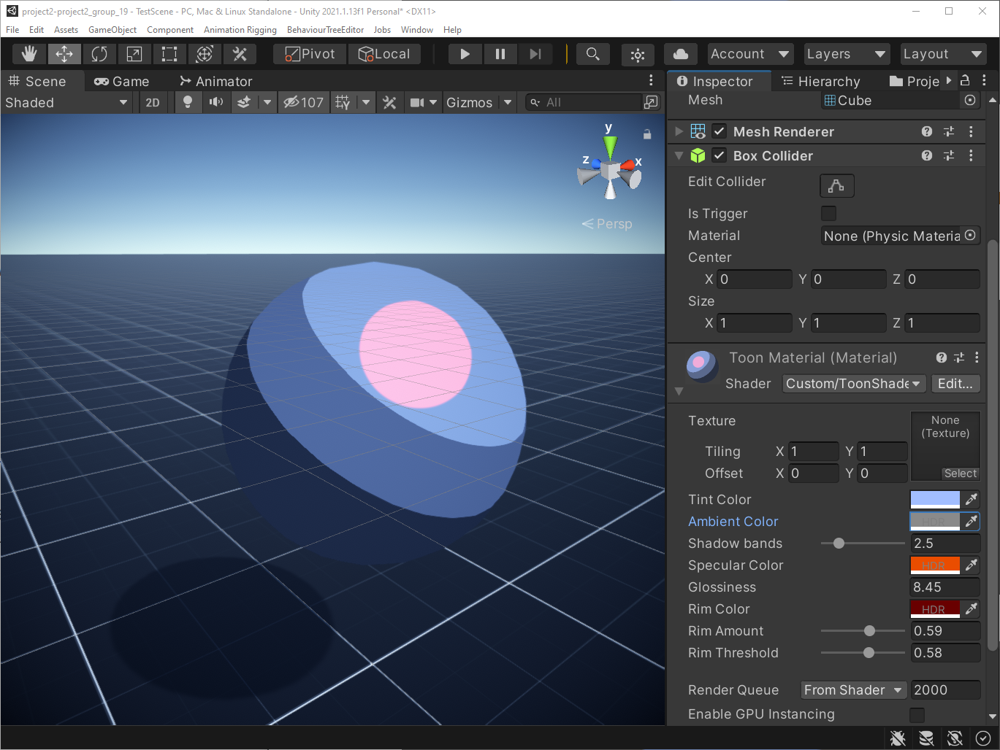

One more thing: the rim at the edge. 

To highlight the edge, we can simply calculate the dot product between the face normal and the view direction, and then subtract it from 1. Then multiply this value by some color and add it to our output.

```CG
[HDR]
_RimColor("Rim Color", Color) = (1,1,1,1)

...

float4 rimDot = 1 - dot(viewDir, normal);
float4 rim = rimIntensity * _RimColor;

return tex * _Tint * (lightIntensity + ambient + specular + rim);
```

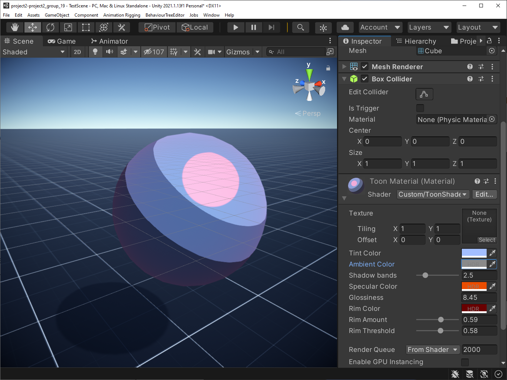

We only want the rim to appear on the illuminated side. To achieve this, we can multiply the `NdotL` from the previous step to the `rimDot`. Also, clamp the fadeout to be toon-like and add some helper variables to control the amount and the shape of the rim.

```CG
_RimAmount("Rim Amount", Range(0, 1)) = 0.716
_RimThreshold("Rim Threshold", Range(0, 1)) = 0.1

...

float rimIntensity = rimDot * pow(NdotL, _RimThreshold);
rimIntensity = smoothstep(_RimAmount - 0.01, _RimAmount + 0.01, rimIntensity);
float4 rim = rimIntensity * _RimColor;
```

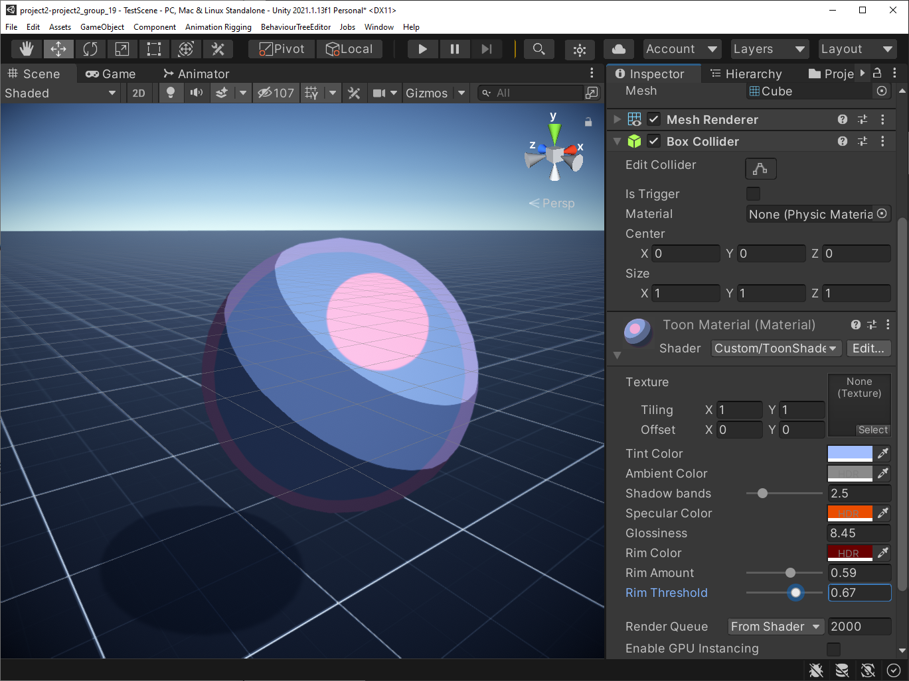

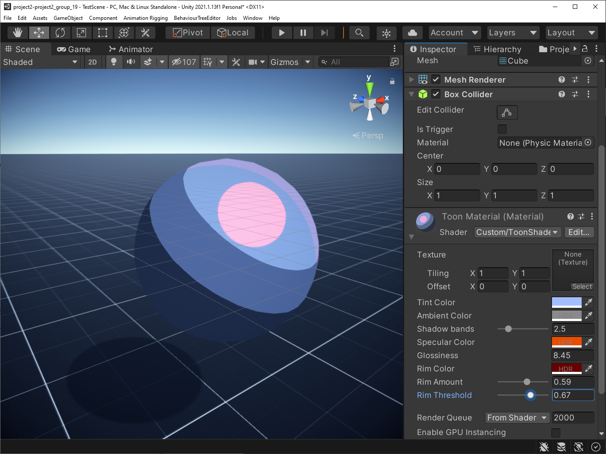

Now it looks great! But if we change the main light in the scene, our shader would still look the same. So now we need to add the main light color `_LightColor0` to the shader.

```CG
float4 light = lightIntensity * _LightColor0 + ambient;
...
float4 specular = specularIntensitySmooth * _SpecularColor * _LightColor0;
...
float4 rim = rimIntensity * _RimColor * _LightColor0;

return tex * _Tint * (light + specular + rim);
```

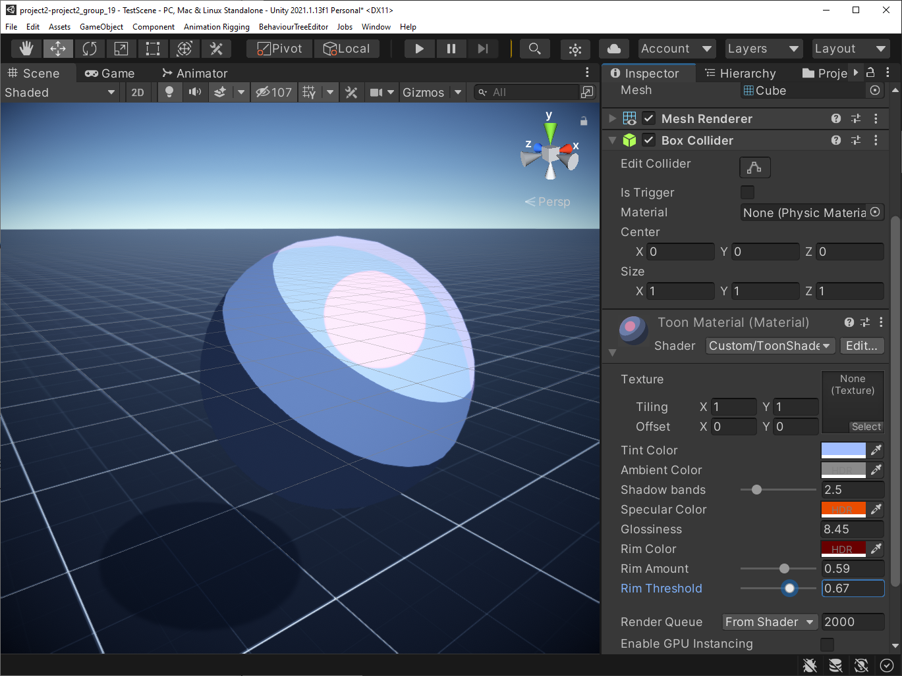

However, this only takes account of the main light (directional light) in the scene. The shader won’t be affected if we add some other point lights/spotlights.

After tons of googling, I learned that I have to add another pass to blend the other lights on top of the original color. This is done by setting the first (original) pass to `ForwardBase` and adding a second pass with the tag `ForwardAdd`. 

The content of the second pass is pretty similar to the first pass, so I won’t expand it again.

```CG
SubShader
{
    Tags {"Queue" = "Geometry" "RenderType" = "Opaque"}
    
    // pass for the directional light (main light)
    Pass
    {
    	Tags 
        { 
        	"LightMode" = "ForwardBase"
        }
        
        ...
    }
    
    // pass for each individual light (additive)
    Pass
    {
    	Tags 
        { 
        	"LightMode" = "ForwardAdd"
        }
        Blend One One // Additively blend this pass with the previous one(s). This pass gets run once per pixel light.
        
        ...
    }
```

We can now get some good-looking lights on our shader thanks to the second pass!

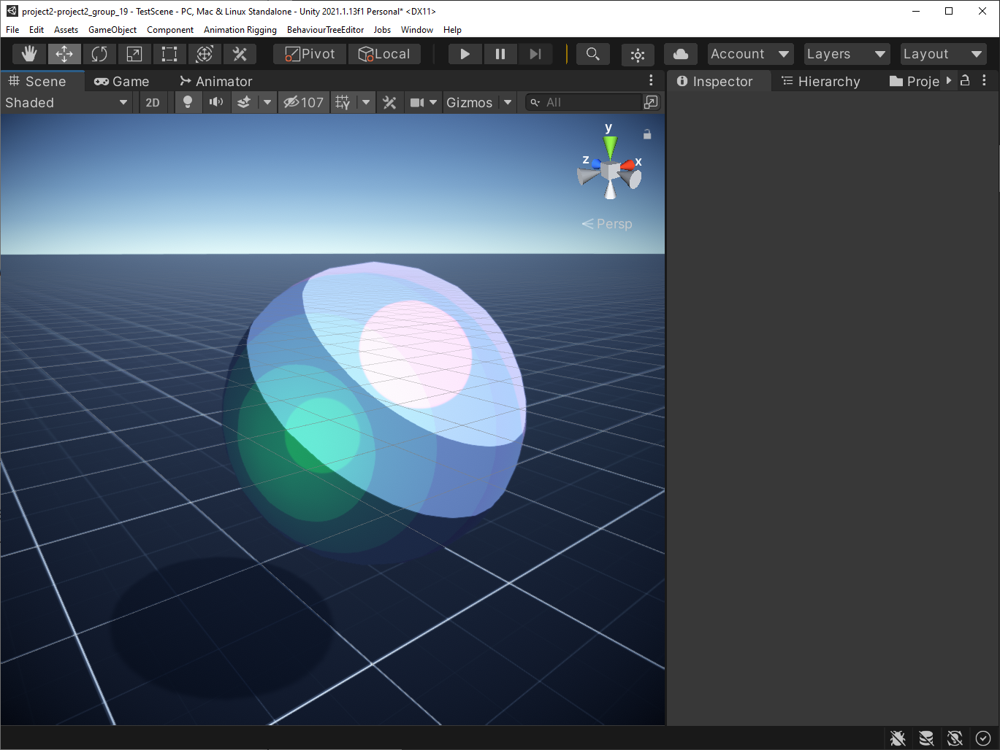

Finally, we need our shader to cast and receive shadows, like everybody else. This is done by adding `FallBack “VertexLit”` at the bottom of my shader. In my understanding, Unity would add all of the `SubShaders` inside this `VertexLit` file to my shader and use them.

P.S. I forgot to comment out this line when taking the screenshot, so all the spheres above are casting shadows on the floor.

This is how it looks like at the end:


### Shield Effect Shader

In the final stage of our boss fight, the boss would spawn a shield to prevent damage from the player. The shield looks exactly like this, but muuuuuuch bigger.

This shader is inspired by this YouTube tutorial [Unity VFX Graph - Shield Effect Tutorial - YouTube](https://www.youtube.com/watch?v=IZAzckJaSO8).

However, in that tutorial, the effect is created using shader graph, which is not supported by the Unity built-in render pipeline. 

So I followed the logic and tried to create a similar shader by hand. 


***File Location:*** `Assets/Shaders/ShieldShader`

To create this shield effect, first, we need a shield mesh.

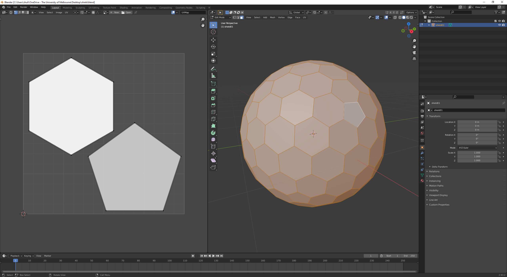

Next, create a fresh unlit shader. This time we need it to be transparent.

```CG
Tags 
{ 
	"RenderType"="Transparent" 
	"IgnoreProjector"="True" 
	"Queue"="Transparent" 
}
```

We want to have different colors on the front and the back of the faces, so we need 2 passes. One is to draw the front face, and the other one is to draw the back faces. In the end, we need to blend these two passes together. The setup looks something like this:

```CG
SubShader
{
	Tags { ... }
	LOD 100
	Blend SrcAlpha OneMinusSrcAlpha
	ZWrite Off
	
	// only render the front faces
	Pass
	{
		Cull Back
		...
	}
	
	// only render the back faces
	Pass
	{
		Cull Front
		...
	}
```

The second pass is very similar to the first pass, so I will just briefly talk about the first pass. 

First, throw the texture onto the mesh and multiply it with the desired color.

```CG
_MainTex ("Texture", 2D) = "white" {}
[HDR]
_FrontColor ("Front Color", Color) = (1,1,1,1)
[HDR]
_BackColor ("Back Color", Color) = (1,1,1,1)

...

fixed4 col = tex2D(_MainTex, i.uv);
col *= _FrontColor; // col *= _BackColor;

return col;
```

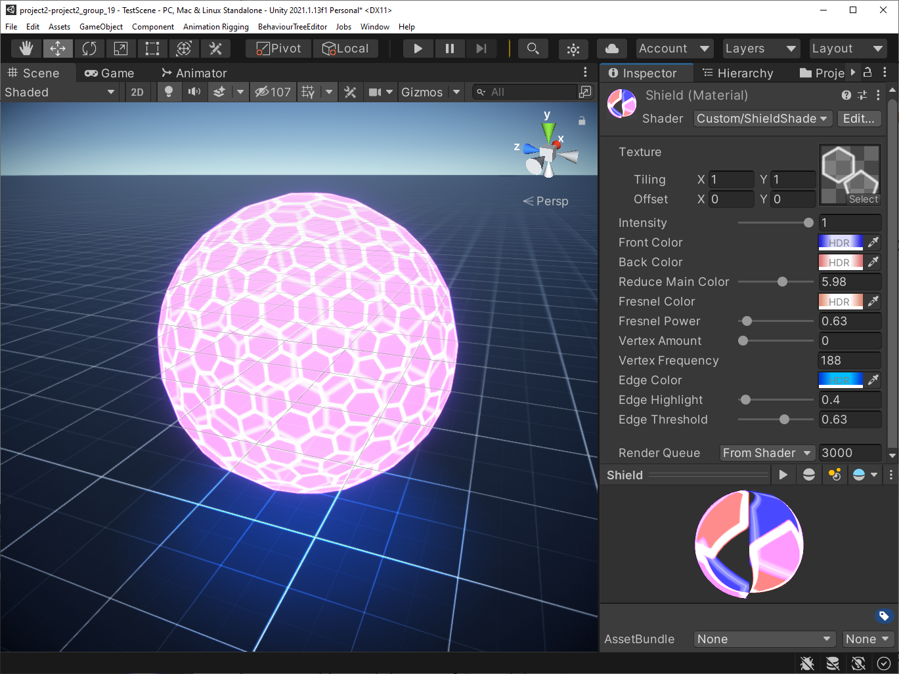

This is too bright. Also, I don’t want the back faces to be very noticeable. So the dot product, once again, comes in handy. 

I only want the back faces to be visible at the edges, so I add 1 to the dot product between the face normal and the view direction. I then divide the value by 2 so the end result lies between 0 ~ 1.

```CG
float3 normal = normalize(i.worldNormal);
float3 viewDir = normalize(i.viewDir);
float NdotV = dot(normal, viewDir);
float intensity = saturate((NdotV + 1) / 2);

return col * intensity;
```

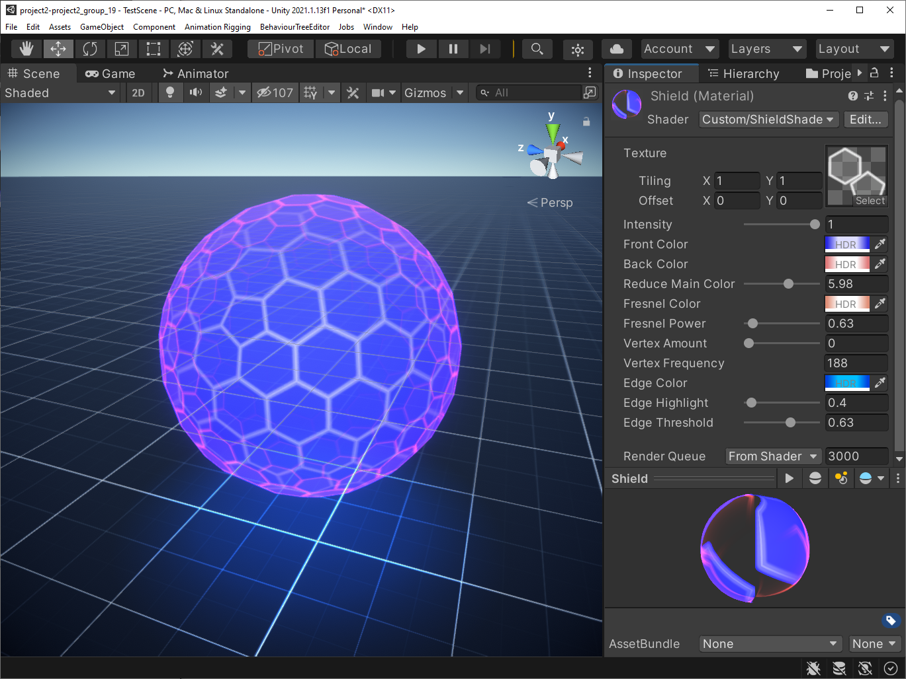

To highlight the edges of each tile, it’s actually pretty simple with the texture we prepared earlier. We first check if the alpha channel of the texture is greater than some threshold. If it is greater, we multiply it by some edge color and then add it to the output.

```CG
[HDR]
_EdgeColor ("Edge Color", Color) = (1,1,1,1)
_EdgeHighlight("Edge Highlight", Range(0, 10)) = 1
_EdgeThreshold("Edge Threshold", Range(0, 1)) = 1

...

float edge = col.a > _EdgeThreshold ? 1 : 0;
return col * intensity + edge * _EdgeHighlight * _EdgeColor;
```

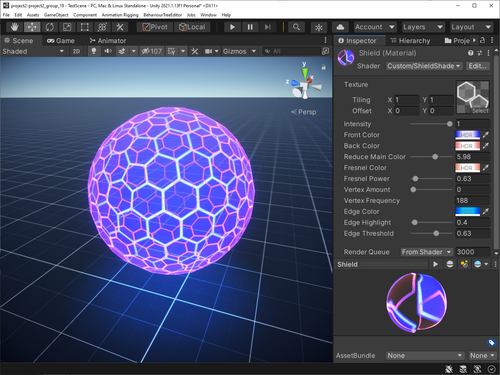

Next is to create some fresnel effect around the edge of the sphere.

This is very similar to the rim effect in the toon shader. We first calculate the dot product between the face normal and the view direction, and then subtract it from 1.

However, after adding the fresnel effect, our shader becomes too bright, so I also added a float variable `_ReduceMainCol` to reduce the original color intensity.

```CG
_ReduceMainCol("Reduce Main Color", Range(0, 10)) = 2
[HDR]
_FresnelColor ("Fresnel Color", Color) = (1,1,1,1)
_FresnelPower("Fresnel Power", Range(0, 10)) = 2

...

float4 fresnelDot = 1 - NdotV;
float4 fresnel = _FresnelColor * fresnelDot * _FresnelPower;

return col * intensity * pow(NdotV, _ReduceMainCol) + (edge * _EdgeHighlight * _EdgeColor) + fresnel
```

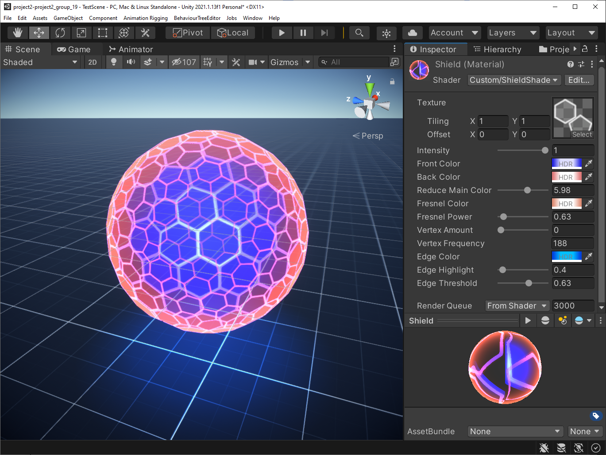

Now it looks great! 

Here comes the fun part, the floating tiles.

We need to offset the tiles along its normal. To achieve this, we need to do some fancy math inside the vertex shader. (BTW everything above is in the fragment shader.)

First, we multiply the face normal by some `_VertexAmount`. Second, to animate the up-and-down, we can use sin() along with the time passed.

```CG
_VertexAmount ("Vertex Amount", Range(0, 1)) = .1
_VertexFrequency("Vertex Frequency", Float) = 1

...

v2f vert (appdata v)
{
	float4 vertex = v.vertex;
	float4 amount = sin(_Time.x * _VertexFrequency) + 1;
	vertex += float4(v.normal, 1) * _VertexAmount * amount;
	o.vertex = UnityObjectToClipPos(vertex);
	...
}
```

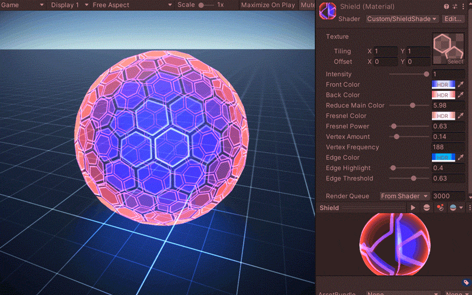

Nice.

But we want individual tiles to float separately. 

My solution is to multiply the frequency variable by a random float so that each vertex would oscillate at a different rate. But we also need to make sure that every vertex on the same tile oscillates with the same frequency.

Luckily, I found this black magic on some forum, to generate a “random” float based on a given input. Now I can simply pass in the face normal to get a “random” frequency for each tile.

```CG
// black magic
float random (float2 uv)
{
	return frac(sin(dot(uv,float2(12.9898,78.233)))*43758.5453123);
}

...

float4 amount = sin(_Time.x * _VertexFrequency * random(v.normal)) + 1;
```

This is the end result:


## Particles

In the second stage of our boss fight, the boss would shoot out a laser towards the player. 

This is the laser effect:


***File Location:*** `Assets/Particles/vfx_Charge`

***File Location:*** `Assets/Particles/vfx_Impact`

This is a composite effect containing multiple particles and also some shaders. I will only discuss the particles here since this report is getting very long...

`vfx_Charge` is the energy sphere at the start of the laser. `vfx_Impact` is the particles and decals at the end of the laser.

Since the particle section is only worth 2 marks, I won’t be explaining all the details as I did in the shader section. I will only show you how I put everything together to create this effect.

### `vfx_Charge`

This effect contains 5 sub-particles. 

The background: glowing spheres.

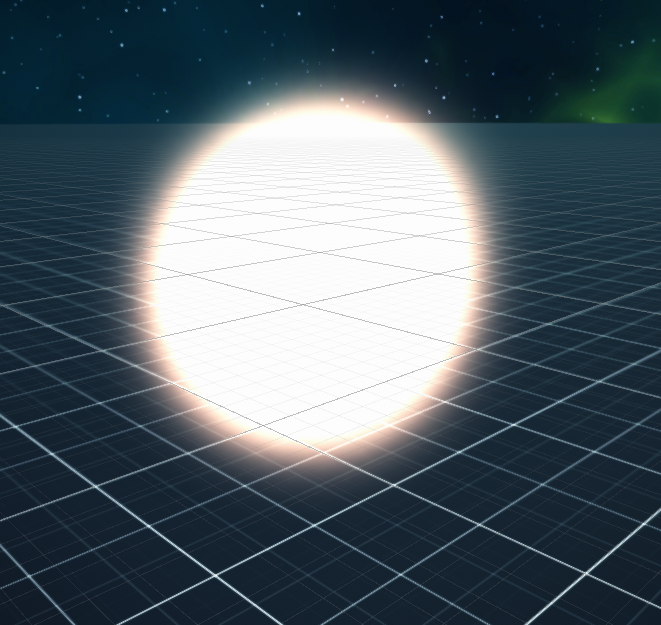

Two sparks, one narrower but longer, one fatter but shorter.

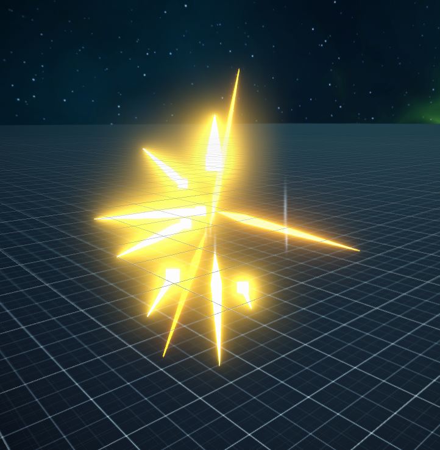

Two shockwaves, one red, one blue.

The frequencies and sizes of these two are different, to give randomness and an energetic feeling.

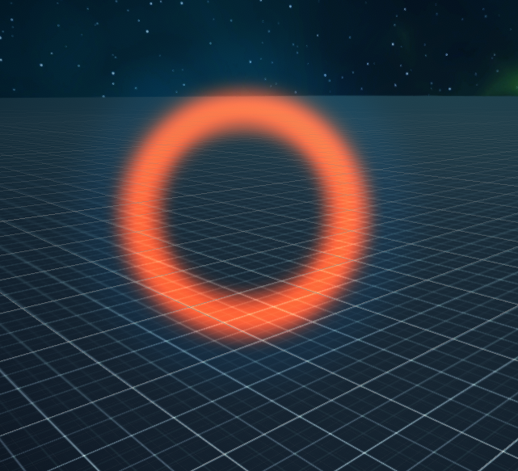

### `vfx_Impact`

This effect is simpler than the previous one. It only contains 3 different effects.

The background glowing hemisphere.

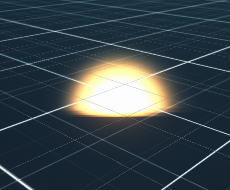

The sparks.

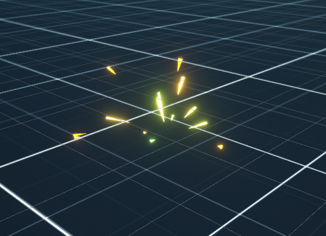

The decals on the floor.

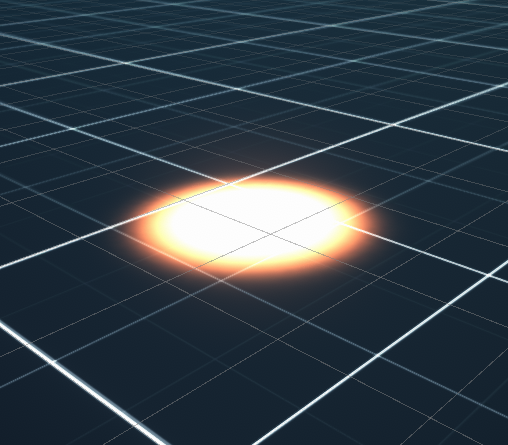

## References

**Shaders and Particles**

- [Writing Multi-Light Pixel Shaders in Unity](http://kylehalladay.com/blog/tutorial/bestof/2013/10/13/Multi-Light-Diffuse.html)

- [Toon Shader](https://roystan.net/articles/toon-shader.html)

- [My take on shaders: Cel shading](https://halisavakis.com/my-take-on-shaders-cel-shading/)

- [My take on shaders: Firewatch multi-colored fog](https://halisavakis.com/my-take-on-shaders-firewatch-multi-colored-fog/)

- [Unity VFX Graph - Shield Effect Tutorial - YouTube](https://www.youtube.com/watch?v=IZAzckJaSO8)

- [Unity VFX Graph - Muzzle Flash Effect Tutorial - YouTube](https://www.youtube.com/watch?v=sgBbnF3r60U&t=617s)

- [Unity Shader Graph - Laser Beam Tutorial - YouTube](https://www.youtube.com/watch?v=mGd3nYXj1Oc)

- [[Unity\] How to make a stylized/cartoony explosion - YouTube](https://www.youtube.com/watch?v=lw4T8gfcKZ0)

**AI**

- [Unity | Create Behaviour Trees using UI Builder, GraphView, and Scriptable Objects - YouTube](https://www.youtube.com/watch?v=nKpM98I7PeM&t=1s)
